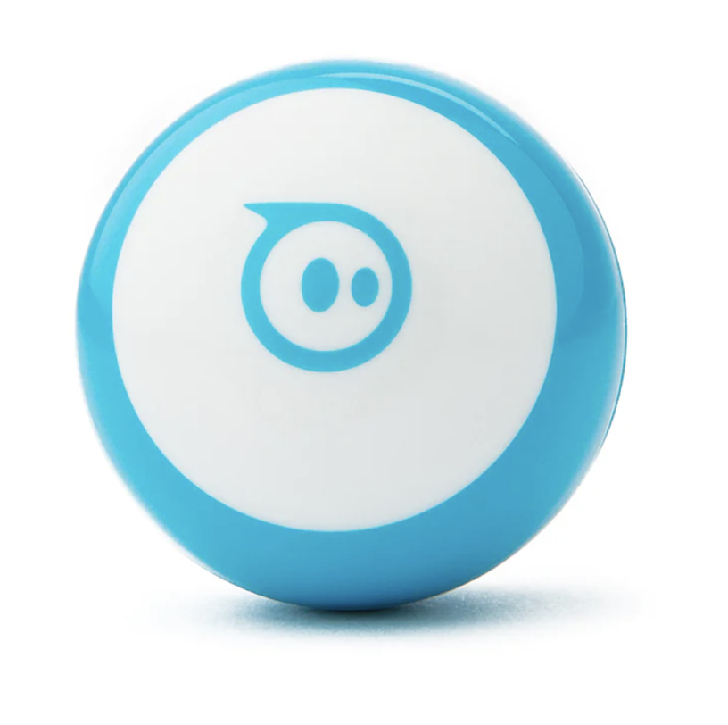
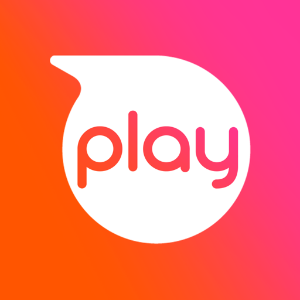
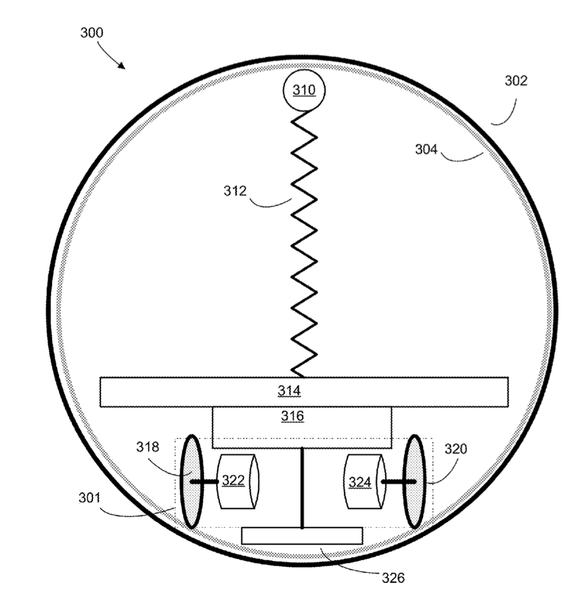
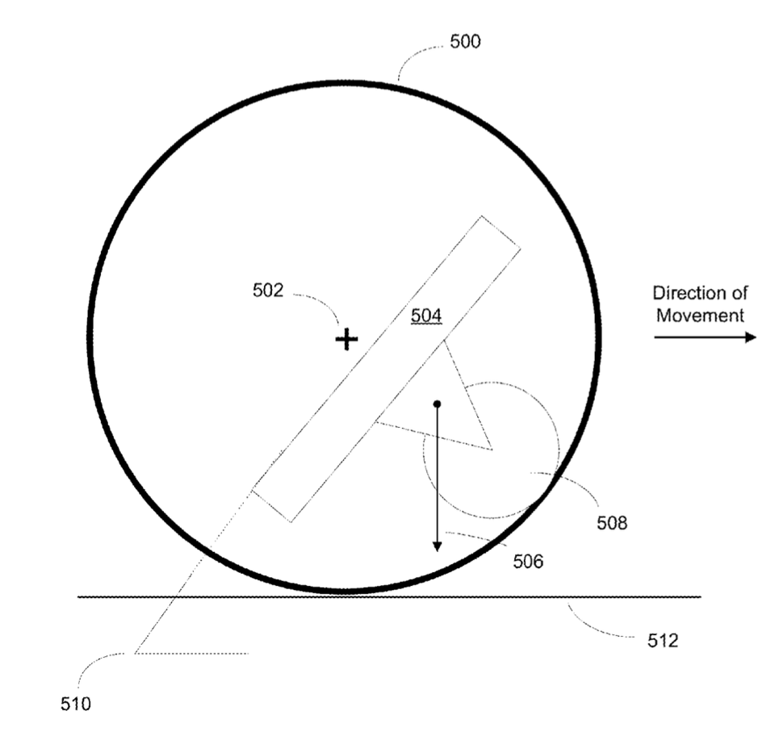
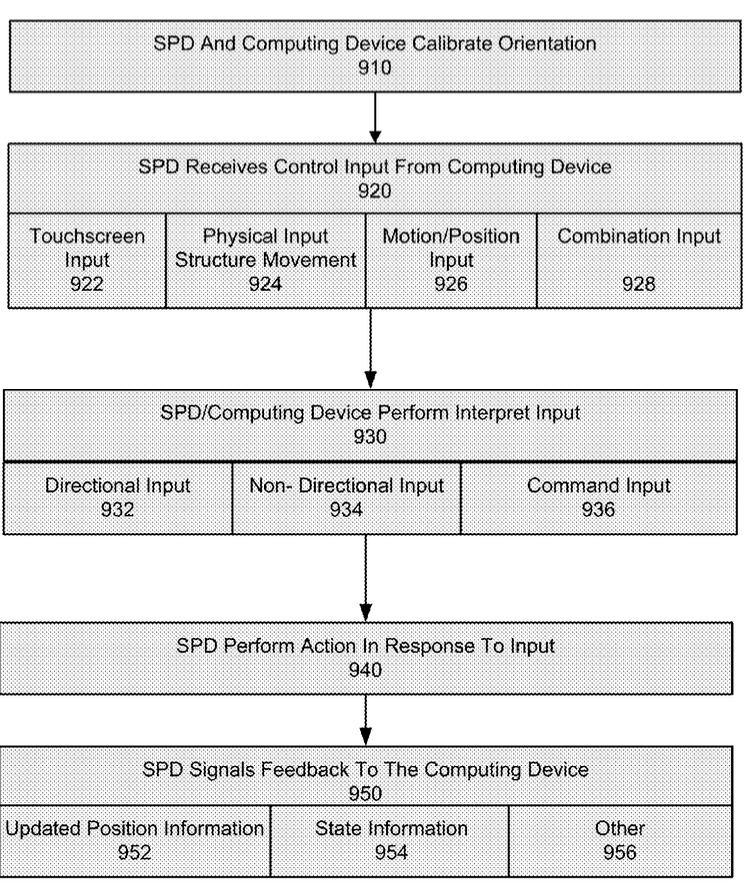
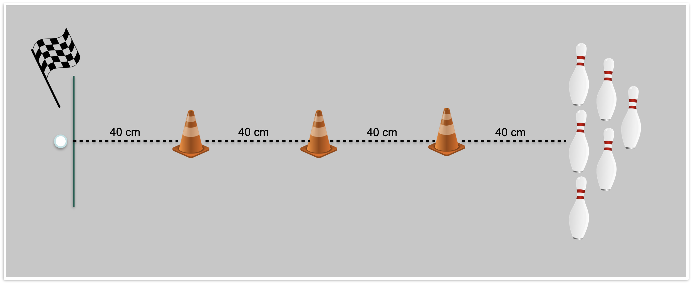

# Sphero Mini
## Allgemeine Informationen
Der Sphero Mini ist ein kugelförmiger Roboter und hat ca. die Größe eines Tischtennisballs. Mit seinen Sensoren kann sein Standort, seine Ausrichtung, Gyroskop, Beschleunigung, Geschwindigkeit und Entfernung erfasst werden. Beim Kauf des Roboters sind zusätzlich noch drei kleine Hütchen und sechs Kegel enthalten. Bedient wird der Sphero Mini mit den Apps Sphero Play und Sphero Edu. Die Ziele beim Verwenden des Roboters sind, Spaß zu haben beim Spielen und spielerisch Programmieren zu lernen. 

### Sphero Play App
Ziel dieser App ist es, dass man Spaß beim Spielen mit dem Roboter hat. Der Sphero Mini kann dabei mit einer Art "Joystick"-Symbol auf dem Handy gesteuert werden. Außerdem gibt es verschiedene Spiele, die in zwei Gruppen unterteilt werden können. Mit der einen Gruppe von Spielen wird der Roboter-Ball auf unterschiedliche Arten gesteuert. Er rollt bei einem der Spiele beispielsweise schneller, wenn lautere Geräusche von sich gegeben werden oder bei einem anderen Spiel mit dem Handy ein Golfschläger simuliert, der Roboter ist entsprechend der Golfball. Bei der zweiten Gruppe von Spielen wird der Roboter zur Steuerung der Spiele in die Hand genommen und das Spiel selbst ist auf dem Handy zu sehen. Dabei wird beispielsweise der Roboter gedreht, um ein Flugzeug zu steuern. 

### Sphero Edu App
Ziel der Edu App ist es, den Usern (grundlegende) Programmierkenntnisse zu vermitteln. In der App wird mit Block-Bausteinen ein "Programm" geschrieben, das dem Roboter dann Anweisungen gibt, wie er sich bewegen soll oder dass er beispielsweise die Farbe ändern soll. Im Hintergrund wird hiermit eine JavaScript-Datei erstellt. Zusätzlich können Nutzende auch selbst ein Programm in JavaScript erstellen, ohne den Zwischenschritt über die Block-Bausteine zu gehen. Diese App gibt es nicht nur für Smartphones, sondern auch für PCs. 

## Drei Teilbereiche der Robotik
Für die folgenden Ausführungen wurde das Patent US009395725B2 des Roboters als Grundlage herangezogen (Bernstein et al., 2016). 
### Mechanik
Der Roboter besteht aus einer runden Außenhülle (302), die das external Surface berührt. In dieser Hülle befindet sich das Driving System (301). Es besteht aus zwei voneinander unabhängigen Rändern (318, 320) mit jeweils einem Motor (322, 324). Die Räder berühren nur die Innenseite der Außenhülle (304) und haben keinen Kontakt zum external Surface. Eine Feder (312) sorgt dafür, dass die Räder immer Kontakt zur Innenseite der Außenhülle haben. Wichtig ist, dass die Räder und das Ende der Feder (310) möglichst geringen Widerstand haben.

Ist der Roboter in Stillstand, liegt der Schwerpunkt mittig und so tief wie möglich. Um eine Bewegung zu initiieren, wird der Schwerpunkt von den beiden Rädern verschoben, wodurch der Roboter zu rollen beginnt. Je größer dabei der Winkel 510 ist, desto schneller rollt der Roboter-Ball. 

### Elektronik 
Der Roboter hat zwei Motoren, die jeweils ein Rad ansteuern. Die Motoren werden von einem Akkumulator betrieben. Außerdem hat der Roboter einen Speicher, einen Prozessor und eine Bluetooth-Antenne, mit der er mit dem externen Gerät (Smartphone, PC) kommuniziert. Für die Bestimmung seiner Position, Geschwindigkeit und Beschleunigung hat der Roboter jeweils drei Gyroskopsensoren, Beschleunigungsmesser und Magentometer, alle ausgerichtet entlang der x-, y- und z-Achse des Roboters.
### Programmierung
Um den Roboter zu steuern, wird der Roboter (self propelled device, SPD) über Bluetooth mit einem externen Gerät wie einem Smartphone oder einem PC verbunden. Im ersten Schritt kalibriert der Roboter seine relative Position und seine relative Orientierung zum externen Gerät und schickt diese an das externe Gerät (910). Das externe Gerät schickt daraufhin Kontroll-Input an den Roboter, der diesen dann interpretiert und ausführt (920). Nun kann der Roboter mit verschiedenen Programmen auf unterschiedliche Art und Weisen gesteuert werden. Der Input, den der User über eine App ins externe Gerät eingibt, wird hierfür in vom Roboter interpretierbare Inputs übersetzt (930). Im Anschluss werden die Befehle ausgeführt (940) und der Roboter gibt Feedback an das externe Gerät, dass der Befehl ausgeführt wurde und über seine neue Position und Orientierung (952).

## Usability Study
### Methodik
Mit dem Roboter werden die folgenden beiden Ziele verfolgt: 
- Spaß am Spielen mit der Sphero Play App (Test 1)
- Einstieg in das Programmieren mit der Sphero Edu App (Test 2).

Der Grad der Erfüllung dieser beiden Ziele durch eine intuitive Steuerung des Roboters wird in der folgenden Usability-Studie überprüft. Die Daten werden dabei durch eine Beobachtung während der Nutzung des Roboters durch die Versuchspersonen unter der Nutzung der Thinking Aloud Methode und durch ein anschließendes qualitatives Interview erhoben. Die Stichprobe (n=4) setzt sich dabei aus Studierenden verschiedener Fachrichtungen mit unterschiedlichen Programmierkenntnissen zusammen. Die Versuchspersonen haben die beiden im Folgenden beschriebenen Aufgaben nacheinander durchgeführt. Es gab keine grundlegende Zeitbegrenzung. 
#### Parkour für Usability-Test 
Für beide Aufgaben wurde ein Parkour genutzt. Dazu wurden drei Pylonen mit jeweils 40 cm Abstand auf einer Linie aufgestellt. Nach weiterem 40 cm Abstand stehen sechs Kegel. Der Parkour ist wie folgt zu bewältigen: Zuerst Slalom um die Pylonen, die Kegel umwerfen und wieder Slalom zurück. 

#### Test 1: Spielen mit der Sphero Play App
Dieser Test besteht aus folgenden Unteraufgaben: 
- Öffnen der App, Roboter verbinden und kalibrieren (Teilaufgabe 1)
- Erster Versuch des Parkour (Teilaufgabe 2)
- 10 Min. Zeit, um sich mit der Steuerung vertraut zu machen und andere Funktionen/Spiele auszuprobieren.
- Zweiter Versuch des Parkour (Teilaufgabe 3)

Dabei wurde erhoben, ob die Versuchspersonen in den drei Teilaufgaben erfolgreich waren und die qualitativen Aussagen der Versuchspersonen wurden erfasst.
Alle Versuchspersonen haben dazu folgende Anweisungen erhalten:
- "Starte die App, verbinde den Roboter mit dem Handy und kalibriere ihn."
- "Versuche, den Parkour abzufahren."
- "Beschäftige dich jetzt 10 min mit dem Roboter."
- "Wiederhole den Parkour."
#### Test 2: Einstieg in das Programmieren mit der Sphero Edu App
Die Versuchspersonen sollen mit den Block-Bausteinen einen Code bauen, mit dem der Parkour bestritten wird. Beurteilt wird dabei, wie erfolgreich die Versuchspersonen die Aufgabe bewältigen, wie effizient der Code ist und welche qualitativen Aussagen die Versuchspersonen treffen. 
Die Verkehrspersonen haben hierfür folgende Anweisung bekommen: "Baue mit den zur Verfügung stehenden Block-Bausteinen einen 'Code', damit der Roboter den Parkour abfährt."
### Versuchspersonen
| Versuchsperson | Alter |Geschlecht | Studiengang | Programmierkenntnisse* |
| --- | --- | --- |---|---|
| VP1 | 25 | männlich |Master Angewandte Informatik |5|
| VP2 | 25 | männlich |Master Chemie|4|
| VP3 | 22 | weiblich |Bachelor Tourismusmanagement|0|
| VP4 | 23 | männlich |Bachelor Maschinenbau|1|

_*Bewertet auf einer Skala von 0 (keine Kenntnisse) bis 5 (sehr gute Kenntnisse)_

### Ergebnisse
#### Ergebnisse der Beobachtung
Alle Versuchspersonen wurden während der Erfüllung der Aufgaben beobachtet. Insgesamt ist festzuhalten, dass alle Versuchspersonen alle Teilaufgaben von Test 1 erfüllt haben. Bei Test 2 wurde die Aufgabe während des Tests für alle Versuchspersonen von der Versuchsleitung vereinfacht, da die Versuchspersonen aufgeben wollten. Die neue Aufgabe war dann nur auf dem "Hinweg" Slalom zu fahren, zu versuchen, die Kegel zu treffen und dann gerade zurück ins Ziel zu fahren. Diese Aufgabe konnten alle Versuchspersonen erfüllen. Zum Erfüllen von Test 1 haben die Versuchspersonen jeweils ca. 15 Minuten gebraucht, für die vereinfachte Version von Test 2 ca. 30 Minuten. 

Es war auffällig, dass alle Versuchspersonen vor allem mit der Kalibrationsfunktion in beiden Apps Probleme hatten. Ihnen war nicht bewusst, dass sie den Roboter nach dem Anheben erneut kalibrieren müssen und auch die Position und die Funktionsweise dieser Funktion waren nicht eindeutig.
Bei Test 1 hat VP4 Teilaufgabe 1 beim ersten Versuch bewältigt; alle anderen Versuchspersonen brauchten dafür mehrere Versuche. In der Zeit zum eigenständigen Ausprobieren der Funktionen haben alle Versuchspersonen einen unterschiedlichen Fokus gesetzt. VP1 hat sich mit der präziseren Steuerung mit der Joystick-Funktion beschäftigt; VP2 hat die verschiedenen Sensor-Daten versucht zu interpretieren. VP3 und VP4 spielten intensiv die verschiedenen Spiele durch. Dabei ist aufgefallen, dass es nicht nachvollziehbar erklärt ist, wie die einzelnen Funktionen und Spiele genutzt werden sollen. 

Bei der Edu App haben alle Versuchspersonen ohne Aufforderung noch zusätzliche Elemente in ihren Code eingebaut, wie beispielsweise einen Wechsel der Lichtfarbe des Roboters, Töne oder zusätzliche Strecken. VP4 hat außerdem deutlich schneller als alle anderen Versuchspersonen verstanden, dass es wichtig ist, den Roboter immer wieder an genau dieselbe Stelle zum Start des Programms zu platzieren und ihn immer neu zu kalibrieren. Insgesamt war es eher  Trail-and-Error-Versuche, um den Parkour zu bewältigen.

#### Ergebnisse des qualitativen Interviews 
Da sich die Antworten der einzelnen Versuchspersonen inhaltlich in etwa entsprachen, werden hier die Antworten auf die sechs Fragen an die Versuchspersonen kumuliert wiedergegeben. 

Frage 1: Wie intuitiv findest du die Bedienung der Play App?
- Positiv: Joystick intuitiv bedienbar.
- Negativ: Steuerung der Spiele nicht klar, Verständnisschwierigkeiten bei der Kalibrierung, Geschwindigkeit des Roboters schwierig zu kontrollieren.
  
Frage 2: Wie intuitiv findest du die Bedienung der Edu App?
- Positiv: Nach dem man sich etwas zurechtgefunden hat, sehr intuitiv.
- Negativ: Zahlen eingeben statt Regler für Geschwindigkeit, am Anfang muss man sehr viel ausprobieren.

Frage 3: Würdest du den Roboter weiterverwenden, wenn du ihn geschenkt bekommen würdest? Falls ja, wofür? Falls nein, warum nicht?
- Alle Versuchspersonen gaben an, dass sie nicht wissen, wofür sie den Roboter im Alltag verwenden würden und gaben daher an, dass sie ihn wahrscheinlich nicht verwenden würden.
- Von einer Versuchsperson wurde auch erwähnt, dass eine Drohne zum Beispiel spannender sei oder von einer anderen, dass die Distanz zum Steuerungsgerät und die Geschwindigkeit des Rogers nicht ausreichen, um ihn weiterzuverwenden. 

Frage 4: Hattest du Spaß beim Verwenden des Roboters? 
- Alle vier Versuchspersonen hatten Spaß.
- Zwei der Versuchspersonen gaben an, dass ihnen die Edu App mehr Spaß gemacht hat als die Play App. 

Frage 5: Glaubst du, man kann mit der Edu App Programmieren lernen?
- Alle vier Versuchspersonen gaben an, dass sie glauben, dass man grundlegende Programmierkenntnisse erlernen kann.
- Sie merkten aber auch alle an, dass sich nicht davon ausgehen, dass man tiefergehende Programmierkenntnisse mit dem Roboter erwerben könnte.

Frage 6: Hast du noch weitere Kommentare oder Anmerkungen? 
- Zwei Versuchspersonen haben erwähnt, dass der Roboter-Ball auf dem Boden immer wieder gerutscht ist und dass er von Unebenheiten immer wieder in falsche Richtungen gerollt ist.
- Eine Versuchsperson hat angemerkt, dass es sehr lange dauert, bis man Ergebnisse mir der Edu App erreicht.
- Eine Versuchsperson hat angemerkt, dass es schwierig ist, komplexere Programme mit der Edu App am Handy zu schreiben. 

#### Zusammenfassung und Fazit
Bei der Play App ist positiv aufgefallen, dass die Steuerung mit dem Joystick-Symbol sehr intuitiv war und dass alle Versuchspersonen Spaß beim Spielen mit dem Roboter hatten. Verbesserungspotenzial besteht darin, dass bei den Spielen genauere erklärt werden muss, wie sie funktionieren bzw. was der User machen muss, da es beispielsweise den Versuchspersonen nicht klar war, dass sie den Roboter zur Steuerung einiger Spiele in die Hand nehmen müssen. Außerdem sollte darauf hingewiesen werden, dass der Roboter neu kalibriert werden muss, wenn er hochgehoben wird. Auch eine genauere Beschreibung, wie das Kalibrieren funktioniert, ist sinnvoll. 

Bezüglich der Edu App kann festgestellt werden, dass sich alle Versuchspersonen einig waren, dass damit grundlegende Programmierkenntnisse erlernt werden können. Auch die "spaßigen Elemente", wie dass Tiergeräusche mit programmiert werden können, wurden als positiv wahrgenommen. Hinzu kommt, dass die User ihr "Programm" jederzeit testen können und sofort Feedback bekommen, was positiv zum Lernfortschritt beiträgt. Allerdings ist auch bei dieser App die Kalibrierungsfunktion nicht intuitiv gestaltet und wurde nur schwer gefunden. Zudem bewirken auch nur leichte Unebenheiten im Boden, dass sich der Roboter in deutlich andere Richtungen bewegt, obwohl die gewünschte Richtung im Programm eigentlich richtig eingegeben wurde.  

Insgesamt erfüllt der Roboter mit den dazugehörigen Apps jeweils das gesetzte Ziel, also dass die User Spaß beim Spielen mit der Play App haben und dass die Edu App grundlegende Programmierkenntnisse vermittelt. Allerdings ist v.a. die Kalibrierungsfunktion in beiden Apps sehr versteckt und wenig intuitiv gestaltet. Außerdem wurden bei beiden Apps viele der zur Verfügung stehenden Funktionen von den Versuchspersonen gar nicht entdeckt bzw. wussten die Versuchspersonen nicht, wie sie genutzt werden. Grundsätzlich haben die Versuchspersonen immer sehr lange gesucht, bis sie die gewünschten Funktionen gefunden haben. Überdies würden die meisten Versuchspersonen den Roboter in ihrer Freizeit wahrscheinlich nicht nutzen. Zukünftig könnte es sinnvoll sein, den Roboter noch mit einer jüngeren Zielgruppe zu testen. 

## Quellen
Bernstein, I. H., Wilson, A., & Hygh, D. E. (2016). Self-Propellled Device implementing three-dimensional Control (Patent US009395725B2). https://patents.google.com/patent/US9395725B2/en?oq=US+9%2c395%2c725+B2

Sphero Mini. (2023). Sphero Inc. https://sphero.com/products/sphero-mini

