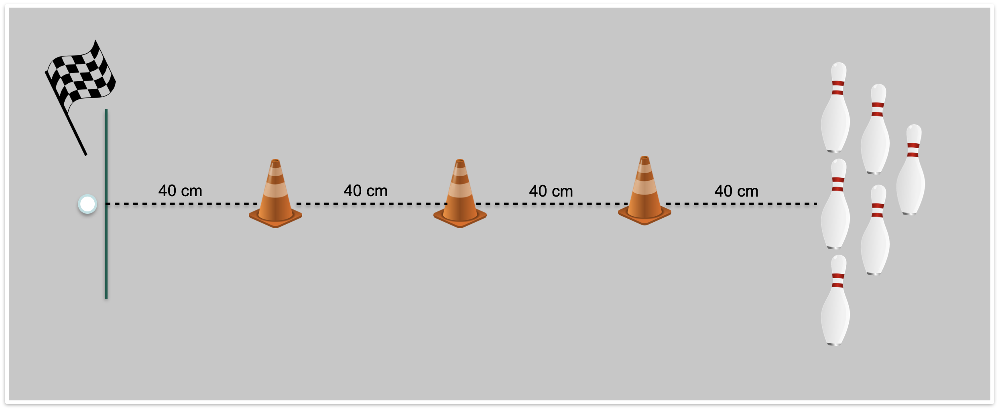

# Spero Mini
## Allgemeine Infomrationen
Der Spehro Mini ist ein kugelförmiger Roboter und hat ca. die Größe eines Tischtennisballs. Mit seinen Sensoren kann sein Standort, seine Ausrichtung, Gyroskop, Beschleunigung, Geschwindigkeit und Entfernung erfasst werden. Beim Kauf des Roboters sind zusätzlich noch drei kleine Hüdchen und sechs Kegel enthalten. Bedient wird der Sphero Mini mit den Apps Sphero Play und Sphero Edu. Die Ziele beim Verwenden der Roboters sind Spaß haben beim Spielen und spielerisch Programmieren lernen. 
### Sphero Play App
Ziel dieser App ist es, dass man Spaß beim Spielen mit dem Roboter hat. Der Sphero Mini kann dabei mit einer Art "Joystick"-Symbol auf dem Handy gesteuert werden. Außerdem gibt es verschiedene Spiele, die in zwei Gruppen unterteilt werden können. Mit der einen Gruppe von Spielen, wird der Roboter-Ball auf unterschiedliche Art gesteuert. Er rollt bei einem der Spiele beispielsweise schneller, wenn lautere Geräusche von sich gegeben werden oder bei einem andern Spiel mit dem Handy ein Golfschläger simuliert und der Roboter ist entspechend der Golfball. Bei der zweiten Gruppe von Spielen wird der Roboter zur Steuerung der Spiele in die Hand genommen und das Spiel selbst ist auf dem Handy zu sehen. Dabei wird beispielsweise der Rototer gedreht, um ein Flugzeug zu steuern. 
### Sphero Edu App
Ziel der Edu App ist es, den Usern (grundlegende) Programmierkentnisse zu vermittelt. In der App wird mit Block-Bausteinen ein "Programm" geschrieben, das den Roboter dann Anweisungen gibt, wie er sich bewegen soll oder dass er beispielsweise die Farbe ändern soll. In Hintergrund wird hiermit ein JavaSkrip erstellt. Zusätzlich können Nutzende auch selbst ein JavaSkirt erstellen, ohne den Zwischenschritt über die Block-Bausteine zu gehen. Diese App gibt es nicht nuf für Smartphones, sondern auch für PCs. 
## Drei Teilbereiche der Robotik
### Elektornik 
### Mechanik
### Programmierung
## Usability Study
### Methodik
Mit dem Roboter werden die folgenden beiden Ziele verfolgt: 
- Spaß am Spielen mit der Sphero Play App (Test 1)
- Einstieg in das Programmieren mit der Spherp Edu App (Test 2).

Der Grad der Erfüllung dieser beiden Ziele durch eine intuitive Steuerung des Roboters, werden in der folgenden Usabitly Studie überprüft. Die Daten werden dabei durch eine Beobachtung während der Nutzung des Roboters durch die Versuchspersonen unter der Nutzung der Thinking Aloud Methode und durch ein anschließendes qualitatives Interview erhoben. Die Stichprobe (n=4) setzt sich dabei aus Studierenden verschiedener Fachrichtungen mit unterschiedlichen Programmierkenntnissen zusammen. Die Versuchspersonen haben die beiden im Folgenden beschriebenen Aufgaben nacheinander druchgeführt. Es gab keine grundlegende Zeitbegrenzung. 
#### Parkur für Usabilty Test 
Für beide Aufgaben wurde ein Parkur genutz. Dazu wurden drei Pylonen mit jeweils 40 cm Abstand auf einer Linie aufgestellt. Nach weitern 40 cm Abstand stehen sechs Kegel. Der Parkur ist wie folgt zu bewältigen: Zuerstst slalom durch um die Pylonen, die Kegel umwerfen und wieder slalom zurück. 

#### Test 1: Spielen mit der Sphero Play App
Dieser Test besteht aus folgenden Unteraufgaben: 
- Öffnen der App, Roboter verbinden und kalibrieren (Teilaufgabe 1)
- Erster Versuch des Parkur (Teilaufgabe 2)
- 10 min Zeit, um sich mit Steruerung vertraut zu machen und andere Funktionen/Spiele auszuprobieren
- Zweiter Versuch des Parkurs (Teilaufgabe 3)

Dabei wurde erhoben, ob die Versuchspersonen in den drei Teilaufgaben erfolgreich waren und die qualitativen Aussagen der Versuchspersoenen wurden erfasst.
Alle Versuchspersonen haben dazu folgende Anweisungen erhalten:
- "Starte die App, verbinde den Roboter mit dem Handy und kalibriere ihn."
- "Versuche den Parkur abzufahren."
- "Beschäftige dich jetzt 10 min mit dem Roboter."
- "Wiederhole den Parkur."
#### Test 2: Einstieg in das Programmieren mit der Sphero Edu App
Die Versuchspersonen sollen mit den Block-Bausteinen einen Code bauen, mit dem der Parkur bestritten wird. Beurteilt wird dabei, wie erfolgreich die Versuchspersonen die Aufgabe bewältigen, wie effizient der Code ist und welche qualitativen Aussagen die Versuchspersonen treffen. 
Die Veruchspersonen haben hierfür folgende Anweisung bekommen: "Baue mit den zur Verfügung stehenden Block-Bausteinen einen „Code“, damit der Roboter den Parkur abfährt."
### Versuchspersonen
Versuchsperson|Alter|Geschlecht|Programmierkenntnisse|Studiengang
### Ergebnisse
#### Ergebnisse der Beobachtung
#### Ergebnisse des qualitativen Interviews 
#### Zusammenfassung und Fazit

